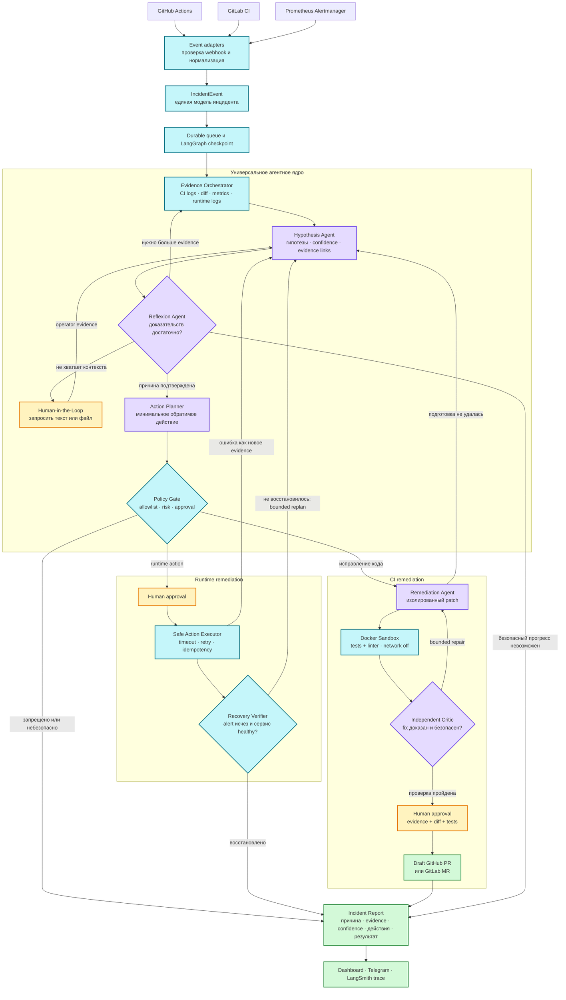

# Incident Investigator

[](LICENSE)

Incident Investigator принимает CI-сбой или runtime-alert, сам собирает доступные
доказательства, проверяет несколько гипотез и предлагает только проверяемое безопасное
действие. Изменение выполняется после подтверждения человека, а затем агент отдельно
проверяет восстановление системы.

Это не ещё один чат с логами. Ядро хранит durable state расследования, ограничивает инструменты
политиками и бюджетами, переживает перезапуск, умеет запросить недостающие данные у оператора
и оставляет воспроизводимый audit trail.

## Попробовать за пять минут

Нужен только запущенный Docker Desktop. Дополнительные репозитории, токены и OpenAI API key
для первого знакомства не требуются.

Windows:

```powershell
.\demo.ps1
```

Linux/macOS:

```bash
sh demo.sh
```

Затем откройте [http://127.0.0.1:8501](http://127.0.0.1:8501).

Стенд внутри этого репозитория сам:

1. запускает неисправное приложение;
2. генерирует трафик и метрики;
3. поднимает Prometheus и Alertmanager;
4. отправляет настоящий webhook;
5. собирает метрики и структурированные логи;
6. останавливается перед rollback и ждёт вашего решения;
7. после approval применяет узкое исправление и проверяет health и исчезновение alert.

Локальный smoke test использует честно обозначенный детерминированный fixture-engine, поэтому
проверяет всю инфраструктуру без оплаты LLM. Для проверки реального модельного рассуждения
добавьте OpenAI key и включите `INVESTIGATOR_MODE=connected` по инструкции ниже.

Остановить стенд:

```powershell
.\demo.ps1 down
```

## Что уже работает

- GitHub Actions `workflow_run`, GitLab Pipeline Hook и Prometheus Alertmanager.
- Единая модель события для CI- и runtime-инцидентов.
- Цикл evidence → hypotheses → verification → Reflexion → action → recovery.
- SQLite queue и LangGraph checkpoints, переживающие перезапуск процесса.
- Таймауты, retry, iteration/tool budgets и безопасная эскалация.
- Bounded replanning: ошибка action tool или recovery check становится новым evidence;
  повтор уже провалившегося действия блокируется.
- Human-in-the-Loop для runtime-действий и публикации draft PR/MR.
- Запрос недостающего контекста через dashboard: текст или TXT/LOG/JSON/YAML.
- Маскирование типовых секретов, provenance и SHA-256 операторских данных.
- Изолированный remediation pipeline: patch → Docker tests/lint → critic → approval.
- Draft GitHub PR или GitLab MR без автоматического merge.
- Telegram-уведомления и LangSmith tracing.
- Русский и английский интерфейс.

## Встроенный CI-сценарий

В `demo/ci-python-app` находится намеренно сломанное приложение. Оно позволяет проверить
поиск причины, patch, pytest, Ruff и critic полностью локально:

```powershell
uv sync --extra dev --extra ui
uv run python scripts/run_remediation_demo.py
```

Во внешний GitHub или GitLab этот сценарий ничего не отправляет.

## Подключение к своему проекту

Создавать отдельный «репозиторий инцидентов» не нужно. Один раз разверните Investigator на
сервере, затем подключайте к нему существующие проекты:

- GitHub/GitLab отправляют webhook о провалившемся pipeline;
- токен с минимальными правами позволяет читать job log и diff;
- Prometheus Alertmanager отправляет firing alerts;
- evidence adapters читают метрики, логи и deployment context;
- action adapter описывает только разрешённые для вашей среды операции.

Начинайте в read-only shadow mode. После накопления успешных расследований включайте draft
PR/MR, а runtime-actions оставляйте за allowlist и approval. Практический план подключения,
права и ограничения текущей версии описаны в
[Production integration guide](docs/production-integration.md).

## Режимы

| Режим | Назначение | LLM |
|---|---|---|
| `demo` | Проверка webhook, queue, checkpoints и UI | Нет |
| `fixture` | Полный встроенный runtime smoke test | Нет |
| `connected` | Настоящее расследование по собранным evidence | OpenAI |

## Архитектура в одном абзаце

Event adapters проверяют подпись и нормализуют внешние payload в `IncidentEvent`. Durable
LangGraph управляет расследованием. Read-only evidence providers возвращают факты с provenance.
LLM формирует структурированные гипотезы, но policy engine, sandbox, approval и recovery
verification находятся вне модели. GitHub, GitLab, Prometheus, Telegram и конкретная LLM
остаются заменяемыми адаптерами.



Фиолетовым обозначены LLM-роли, голубым — детерминированные компоненты безопасности и
интеграций, жёлтым — точки Human-in-the-Loop. Ошибка исполнения или неуспешная проверка
восстановления не завершает worker: она становится новым evidence и запускает ограниченное
перепланирование.

Подробнее: [архитектура](docs/architecture.md), [модель угроз](docs/threat-model.md),
[observability и evals](docs/observability.md), [установка](docs/deployment.md),
[сценарий защиты](docs/demo-runbook.md),
[соответствие исходному ТЗ](docs/requirements-compliance.md),
[редактируемая агентная диаграмма](docs/agent-architecture.excalidraw),
[аудит по книге об AI-агентах](docs/book-review.md).

## Что проект не обещает

Investigator не может без настройки понимать любую инфраструктуру и не должен получать
неограниченный shell или административные credentials. Универсален lifecycle расследования;
форматы логов, runbooks и разрешённые действия задаются адаптерами конкретной среды.

Текущая SQLite-реализация рассчитана на ноутбук или один server process. Для нескольких
replicas очередь и checkpoints нужно перенести в PostgreSQL.

## Разработка

```powershell
uv sync --extra dev --extra ui
uv run ruff check src tests scripts demo
uv run pytest
```

Проект использует Python 3.12+, FastAPI, LangGraph, Streamlit, OpenAI Structured Outputs,
Docker sandbox и LangSmith.

## Лицензия

Проект распространяется по [Apache License 2.0](LICENSE).
